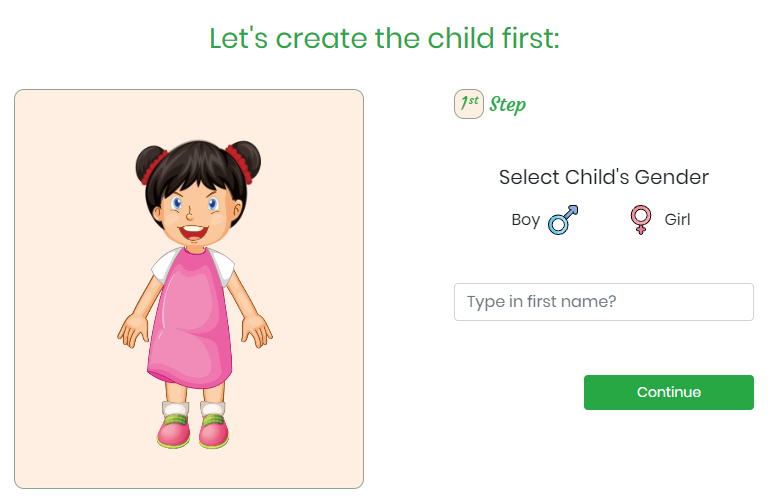

# :family_woman_woman_girl_boy: Personalized Characters App - 2020



### About

Fully resoponsive app. You can create your own virtual characters. It has 2 characters (child + parent) but can be added more if needed.
Each character can have different: Gender, Skin Tone, Hair color & type, Beard(just for parent Male), Glasses, Eye Color & Shape.

The characters can be fully customized (the functionality exists). I have reused some ilustrations.

The app has Snipcart integrated which will pass the final selections as product description.

### About - used technology

App built with Vue CLI - Vue version 2.6
Used Sass, Bem & Bootstrap for some buttons.

Each component is a multi step form with validation.
For the animation of checkboxes I have used pretty-checkbox-vue version 1.1 .
The data is passed between components through \$emit and props. I haven't used Vuex.
The app has Snipcart integrated which will pass the final selections as product description.

### Project setup

```
npm install
```

### Compiles and hot-reloads for development

```
npm run serve
```

### Compiles and minifies for production

```
npm run build
```

### Lints and fixes files

```
npm run lint
```

##### _Author: Stefan Tutuianu_ :green_heart:
